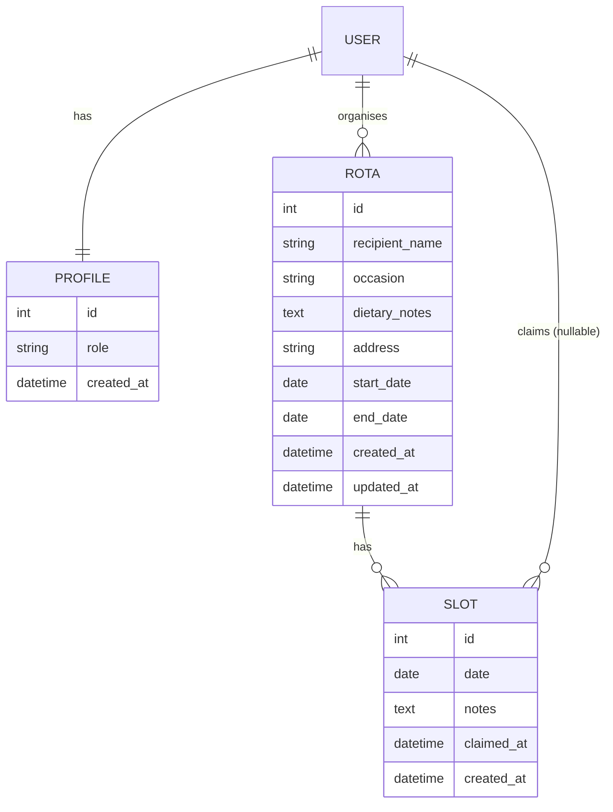
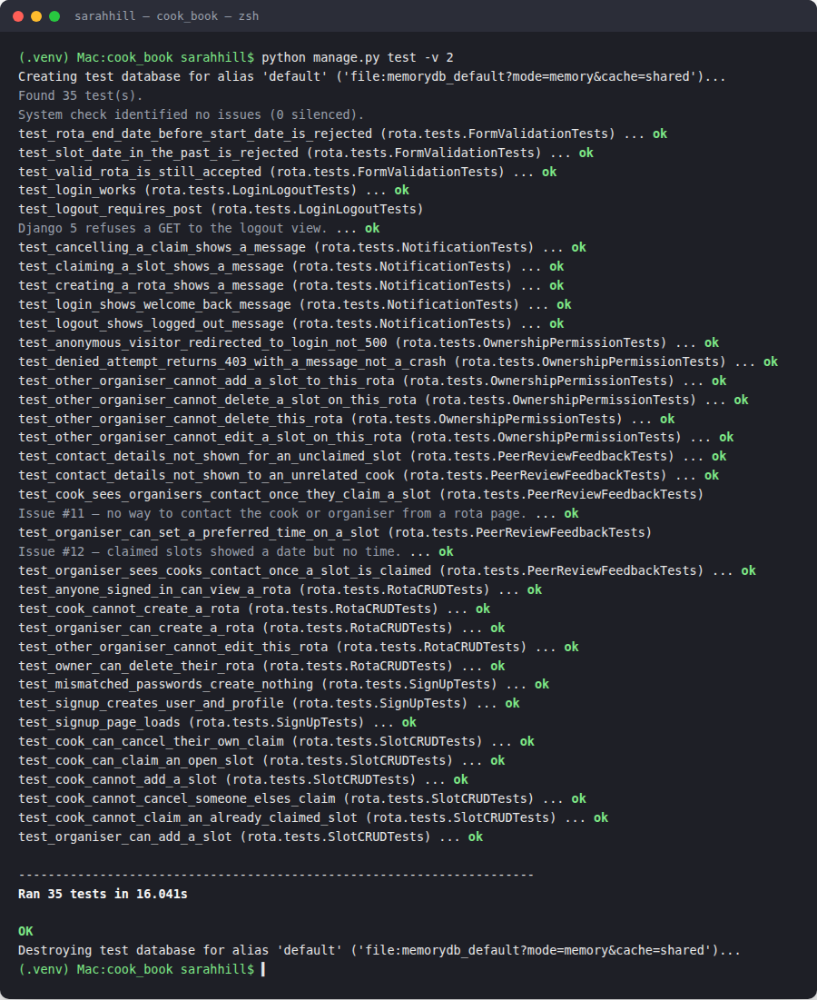
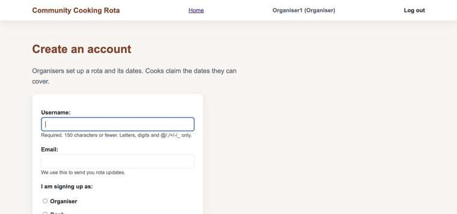
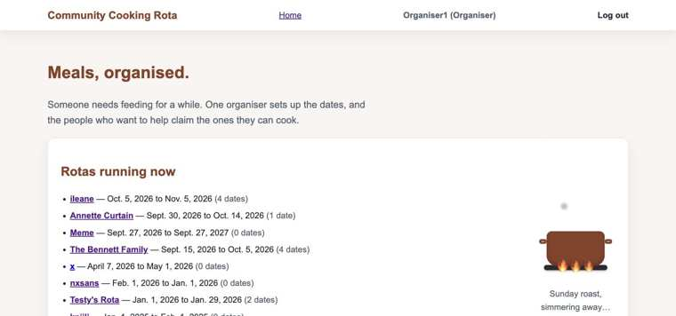
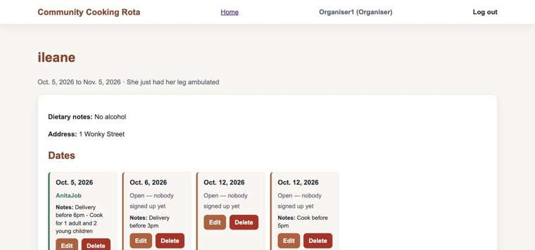

# Community Cooking Rota

**Live app:** <a href="https://community-cooking-rota-a0e405aa09f1.herokuapp.com/" target="_blank" rel="noopener">community-cooking-rota-a0e405aa09f1.herokuapp.com</a>
**Repository:** <a href="https://github.com/sarahjhill/cooking-rota" target="_blank" rel="noopener">github.com/sarahjhill/cooking-rota</a>

Developer: Sarah Hill (<a href="https://github.com/sarahjhill" target="_blank" rel="noopener">sarahjhill</a>)


## Introduction

Community Cooking Rota is a Django web app that helps a support network organise home-cooked meals for someone going through a hard patch — new parents, a household recovering from surgery or bereavement, or an elderly neighbour who could use the help. An organiser creates a rota for the recipient, sets the dates, and invites cooks; each cook registers, claims an open slot, and can see delivery and dietary details, cancelling if their plans change. It replaces the ad-hoc spreadsheet-and-WhatsApp approach with a simple, accountable, full CRUD web app built around one real, everyday problem.

I chose this idea because I'd already seen the problem it solves play out informally, in a WhatsApp group and a shared spreadsheet, for a `cardiff-community-meals` rota I'd been part of. That version worked, but only just: no accounts, no real permissions, and no way to know at a glance who still needed to sign up. Rebuilding it properly as an account-based Django app let me solve a problem I understood first-hand, while also giving me a natural, non-contrived reason to build full CRUD, role-based access control and a real permissions model — exactly what this assessment needs to see.

This is a Full-Stack Individual Capstone Project for the Code Institute AI Augmented Full-Stack Bootcamp.

## UX — The 5 Planes

### 1. Strategy

**Purpose**

Give a small support network (family, friends, neighbours) a single, accountable place to organise a rota of home-cooked meals for someone who needs them — replacing an ad-hoc spreadsheet or WhatsApp thread, where it's easy to lose track of who's already signed up.

**Primary user needs**

- An **organiser** needs to set up a rota quickly, control who can edit it, and see at a glance which dates are still unclaimed.
- A **cook** needs a simple, low-friction way to see what's needed and claim (or cancel) a date, along with any dietary notes or delivery details.
- Both need confidence that only the right people can change a rota or claim on someone else's behalf.

**Project goals**

- Demonstrate a genuinely useful, real-world tool — not a contrived CRUD demo.
- Show full CRUD, custom role-based authentication, and a real permissions model (not just `login_required`).
- Ship something accessible and responsive enough that a non-technical support network could actually use it.

### 2. Scope

**Features** (see [Features](#features) below for the full list)

**Content requirements**

- Rota: recipient name, occasion, dietary notes, address, date range.
- Slot: a single cooking date, optionally claimed by a cook, with notes.
- Role-aware navigation (Organiser / Cook / signed-out visitor).
- On-page notifications for every create, update, delete and claim action.
- Custom 403 / 404 / 500 error pages that stay in the site's own style.

### 3. Structure

**Information architecture**

- **Navigation** (see `templates/base.html`): Home is always visible. Signed out, the nav offers Log in / Sign up. Signed in, it shows the user's name and role (e.g. "sarah (Organiser)"), a Log out button, and an Admin link for staff users.
- **Homepage**: lists every rota currently in the system (open to anyone, signed in or not), so a visitor can see the concept before creating an account.
- **Rota detail page**: the recipient's details (occasion, dietary notes, address) followed by a calendar-style grid of every date/slot on that rota, each showing its status (open / claimed, and by whom) plus whatever action applies to the viewer.

**User flow**

- Guest → browses the homepage and an open rota → registers as Organiser or Cook to actually do anything.
- Organiser → creates a rota → adds dates (slots) to it → edits/deletes as things change.
- Cook → browses a rota's open dates → claims one → can cancel their own claim later if plans change.

### 4. Skeleton

**Wireframes**

Low-fi wireframes for the core screens (homepage, rota list, rota detail/slot list) were sketched before development, covering the mobile-first layout and the desktop breakpoint. See <a href="docs/wireframes.md" target="_blank" rel="noopener"><code>docs/wireframes.md</code></a> for the full set.

**Deviation from the wireframes:** the wireframes sketched a desktop (≥768px) layout with the rota list and rota detail side-by-side in two columns. The build uses separate full-page views instead (list page → detail page) at every breakpoint. This was a deliberate call, not an oversight — a split view adds real complexity (keeping two panels in sync, extra routing/JS) for a capstone where the core assessed behaviour is the CRUD/permissions logic underneath, not the layout shape. Every other element of the wireframes (nav, cards, slot grid) is followed as sketched, and the layout is fully responsive at mobile/tablet/desktop.

### 5. Surface

**Colour scheme**

A warm, kitchen-table palette rather than a corporate one, since the app is about neighbours cooking for each other, not a SaaS dashboard.

| Swatch | Variable | Hex | Use |
|---|---|---|---|
| 🟫 | `--primary` | `#b85c38` | Buttons, links, primary actions |
| 🟤 | `--primary-dark` | `#8a4128` | Hover/active states |
| ⬜ | `--bg` | `#f8f5f1` | Page background (warm off-white) |
| ⬜ | `--panel` | `#ffffff` | Cards and panels |
| ⬛ | `--text` | `#1f2933` | Body text |
| ◽ | `--muted` | `#52606d` | Secondary/muted text |
| ▫️ | `--border` | `#e5e7eb` | Borders and dividers |

Defined once as CSS custom properties at the top of `static/css/styles.css`, so the whole site's palette can be re-themed from one place.

**Typography**

The system default sans-serif stack (`Arial, sans-serif`) is used throughout, deliberately — no external font request, which keeps the site fast to load and avoids a flash of unstyled text, and system fonts are already accessible and familiar to every visitor's device.

## User Stories

| Target | Expectation | Outcome |
|---|---|---|
| As a **visitor** | I would like to see rotas that exist and what they need | so that I understand what the site does before creating an account |
| As a **visitor** | I would like to register as an Organiser or a Cook | so that I can start using the site in the role that fits me |
| As an **organiser** | I would like to create a rota for a recipient with their dietary notes, address and a date range | so that I have one place to co-ordinate meals for them |
| As an **organiser** | I would like to add cooking dates (slots) to a rota | so that cooks have specific dates they can claim |
| As an **organiser** | I would like to edit or delete a rota, or a slot on it | so that I can correct mistakes or respond to changing plans |
| As an **organiser** | I would like only me to be able to edit or delete my own rotas | so that another user can't accidentally (or deliberately) change my rota |
| As a **cook** | I would like to see which dates on a rota are still open | so that I know what's still needed |
| As a **cook** | I would like to claim an open date | so that the organiser and other cooks know it's covered |
| As a **cook** | I would like to see dietary notes and the delivery address for a rota | so that I know what and where to cook for |
| As a **cook** | I would like to cancel a date I've claimed | so that I can back out if my plans change, and free the slot for someone else |
| As a **cook** | I would like only me (or the organiser) to be able to un-claim my slot | so that nobody else can cancel my commitment on my behalf |
| As **any signed-in user** | I would like clear on-page confirmation after every action | so that I know a create/update/delete/claim actually worked |
| As **any user** | I would like a friendly error page if I get lost, or if something goes wrong | so that it's obvious what happened, in a page that still looks like the rest of the site |
| As **any user** | I would like the site to work well on my phone | so that I can check or claim a date wherever I am |

## The idea

A Django rebuild of the rota concept from the `cardiff-community-meals` project, reworked as a full account-based CRUD app (rather than a static link-and-access-code page) so it satisfies the auth, CRUD and testing requirements of this assessment.

- **Organiser** — creates a rota for a recipient, sets the date range, invites cooks, edits or deletes the rota and its slots.
- **Cook** — registers/logs in, browses open slots on rotas they've been invited to (or that are public), claims a slot, can cancel their own claim, sees dietary notes and delivery details.

## Features

### Existing Features

| Feature | Notes |
|---|---|
| Sign up with a role | Custom sign-up form (built on Django's own `UserCreationForm`) adds an Organiser/Cook role choice at registration, creating a linked `Profile`. |
| Log in / Log out | Django's built-in auth views (`django.contrib.auth.urls`), styled to match the rest of the site. |
| Role-aware navigation | The nav bar shows the signed-in user's name and role, or Log in/Sign up when signed out. |
| Homepage rota list | Every rota in the system is listed, open to visitors and signed-in users alike, so the concept is visible before signing up. |
| Rota CRUD (Organiser) | Create, view, edit and delete a rota (recipient, occasion, dietary notes, address, date range) — organiser-only. |
| Slot CRUD (Organiser) | Add, edit and delete individual cooking dates within a rota — organiser-only. |
| Claim a slot (Cook) | A signed-in Cook can claim any open date on a rota via a simple form — no admin panel needed. |
| Cancel a claimed slot | The cook who claimed a date (or the rota's organiser) can un-claim it, freeing it up again. |
| Slot notes visible on the rota page | Any notes left on a slot (e.g. delivery instructions) show directly on the rota's date grid. |
| Calendar-style date grid | The rota detail page shows every date as a card in a responsive grid, rather than a plain list, with its status and available action. |
| Ownership/permission checks | Every mutating view (create/edit/delete/claim/cancel) checks the signed-in user's ownership or role before allowing the action; anonymous and wrong-user access is redirected or denied. |
| On-page notifications | Django `messages` banners confirm every create/update/delete/claim/cancel action, plus welcome/logout messages. |
| Form validation | A rota's end date can't be before its start date; a new rota can't start in the past; a slot date already in the past can't be claimed against. |
| Visible field-level errors | Invalid form fields get both an error message and a red outline on the specific input, so it's obvious which field needs fixing. |
| Custom 403 / 404 / 500 pages | Permission-denied, not-found and server-error pages all stay within the site's own look and feel, rather than Heroku's/Django's defaults. |
| Favicon | A simple pot-and-steam icon matching the site's colour palette. |
| Fully responsive layout | Custom CSS Grid layout with media queries at 600px/700px — no CSS framework. |
| Accessible by design | Skip-to-content link, visible `:focus-visible` outlines, and labelled form fields throughout (audited against WCAG 2.1 AA). |

### Future Features

| Feature | Notes |
|---|---|
| Recipe/dish attached to a slot | What's being cooked, with its own CRUD and allergen tags. |
| Comment thread on a rota | So cooks can leave notes for each other, not just the organiser. |
| Swap requests between cooks | Hand a claimed date to another cook without un-claiming and re-claiming. |
| Email reminders | A reminder email the day before a claimed slot. |
| Public invite link / join code | A lighter-weight way to invite cooks, layered on top of the existing accounts. |
| iCal export / calendar view | Export a rota's dates to the cook's own calendar app. |
| Delivery confirmation photo | An optional photo upload once a meal is delivered. |
| Search/filter rotas | By dietary tag or date range, once the number of rotas grows. |

## Data Model (ERD)



`User 1—1 Profile` · `User 1—N Rota` (as organiser) · `Rota 1—N Slot` · `User 1—N Slot` (as cook, nullable until claimed)

- A Slot's `cook` field starts empty (unclaimed). A cook claiming a slot is an **update** on an existing Slot, not a new model.
- Only a Rota's organiser can create/edit/delete that Rota and its Slots.
- Only a Slot's claimant (or the Rota's organiser) can un-claim it.

See <a href="docs/erd.md" target="_blank" rel="noopener"><code>docs/erd.md</code></a> for the full field-by-field breakdown, and the <a href="https://gitdiagram.com/sarahjhill/cooking-rota" target="_blank" rel="noopener">auto-generated architecture diagram on GitDiagram</a> for how requests actually flow through the app (URLs → views → access control → models).

## Tools & Technologies

| Tool / Tech | Use |
|---|---|
| <a href="https://www.python.org/" target="_blank" rel="noopener">Python</a> | Back-end programming language |
| <a href="https://www.djangoproject.com/" target="_blank" rel="noopener">Django</a> | Python web framework used for the whole site |
| <a href="https://www.postgresql.org/" target="_blank" rel="noopener">PostgreSQL</a> | Relational database (production, via Heroku) |
| <a href="https://www.sqlite.org/" target="_blank" rel="noopener">SQLite</a> | Relational database (local development) |
| <a href="https://gunicorn.org/" target="_blank" rel="noopener">Gunicorn</a> | Python WSGI HTTP server, used in production |
| <a href="https://whitenoise.readthedocs.io/" target="_blank" rel="noopener">WhiteNoise</a> | Serves static files (CSS/JS) in production |
| <a href="https://www.heroku.com/" target="_blank" rel="noopener">Heroku</a> | Hosting the deployed app |
| <a href="https://git-scm.com/" target="_blank" rel="noopener">Git</a> | Version control (`git add`, `git commit`, `git push`) |
| <a href="https://github.com/" target="_blank" rel="noopener">GitHub</a> | Secure online code storage and issue tracking |
| <a href="https://code.visualstudio.com/" target="_blank" rel="noopener">VS Code</a> | Local IDE for development |
| HTML5 / CSS3 | Site structure and styling (no CSS framework) |
| <a href="https://docs.djangoproject.com/en/5.2/ref/templates/language/" target="_blank" rel="noopener">Django Template Language</a> | Server-rendered page templates |
| <a href="https://mermaid.js.org/" target="_blank" rel="noopener">Mermaid</a> | Interactive ERD, rendered directly in this README on GitHub |
| <a href="https://claude.com/" target="_blank" rel="noopener">Claude (Anthropic)</a> | Planning, debugging and pair-programming assistance throughout — see [AI usage](#ai-usage) |

## Screenshots

| Homepage | Rota detail (calendar view) |
|---|---|
|  |  |

**Responsive check:** the front end was tested by hand across desktop, tablet and mobile breakpoints (see the CSS media queries at 600px/700px, and the "Responsive styling pass" note above). A live, generated device-mockup check is available at <a href="https://fireship.dev/amiresponsive?url=https://community-cooking-rota-a0e405aa09f1.herokuapp.com/" target="_blank" rel="noopener">Am I Responsive?</a>.

## Tech stack

- Django 5 + Python 3
- SQLite locally, PostgreSQL in production
- Custom CSS (no framework) — CSS Grid, custom properties, and media queries at 600px/700px
- Django's built-in auth (`User` + a `Profile` model with a role field)
- Heroku for deployment

## Local setup

```bash
git clone https://github.com/sarahjhill/cooking-rota.git
cd cooking-rota
python3 -m venv .venv
source .venv/bin/activate   # Windows: .venv\Scripts\activate
pip install -r requirements.txt
python manage.py migrate
python manage.py runserver
```

## Testing

### Automated tests

30 tests across 7 test classes, covering signup/login/logout (including on-page welcome/logout messages), Rota CRUD, Slot CRUD, ownership/permission checks on every mutating view (anonymous and wrong-user access correctly redirected or denied with a custom 403 page), on-page notifications for every create/update/delete/claim action, and form validation (rejecting an end date before the start date, a new rota starting in the past, and a slot date already in the past). Run them with:

```bash
python manage.py test
```

| Result |
|---|
|  |
| A real terminal run, all 30 passing. |

### Manual testing

Every user-facing flow (register as each role, create/edit/delete a rota, add/edit/delete a slot, claim, cancel) was walked through by hand on both desktop and mobile.

### SME review

A live walkthrough of the app with a Subject Matter Expert, run against the <a href="docs/sme-code-review-demo.html" target="_blank" rel="noopener">SME code review demo guide</a>. Feedback was logged as real GitHub issues (labelled <a href="https://github.com/sarahjhill/cooking-rota/issues?q=is%3Aissue+label%3Asme-feedback" target="_blank" rel="noopener"><code>sme-feedback</code></a>) rather than just discussed and forgotten.

| Findings |
|---|
| <a href="docs/sme-review-findings.md" target="_blank" rel="noopener"></a> |
| Click the image for the full write-up. |

- <a href="https://github.com/sarahjhill/cooking-rota/issues/11" target="_blank" rel="noopener">Issue #11 — No way to contact the cook or organiser from a rota page</a> (Medium)
- <a href="https://github.com/sarahjhill/cooking-rota/issues/12" target="_blank" rel="noopener">Issue #12 — Claimed slots show a date but no time</a> (Low)

### Validators

HTML, CSS and Python (PEP8) validator results to be added here.

### Accessibility (WCAG 2.1 AA)

Audited for labelling, colour contrast and keyboard navigation. Full write-up and the contrast table are in <a href="docs/accessibility-audit.md" target="_blank" rel="noopener">the accessibility audit</a>; in short, colour contrast already passed everywhere (lowest is 4.54:1 against a 4.5:1 requirement), one real labelling gap was found and fixed (per-date action buttons now include the date in their accessible name for screen readers), and a keyboard-focus bug was fixed where an invalid form field's error outline silently hid the browser's own focus ring.

| Sign-up form — keyboard focus visible | Homepage — colour palette | Rota detail — before the label fix |
|---|---|---|
|  |  |  |
| Native browser focus ring, now guaranteed everywhere via CSS. | Every colour pairing here passes 4.5:1 contrast. | The "Edit"/"Delete" buttons that read identically to a screen reader before `aria-label` was added. |

## Deployment

Deployed to Heroku from this repository's `main` branch.

1. Create the Heroku app and add a Postgres database (`heroku addons:create heroku-postgresql`, or via the Dashboard's Resources tab).
2. Set the required Config Vars in the Heroku Dashboard (Settings → Config Vars) or via CLI:
   - `SECRET_KEY` — a unique Django secret key (never the one used locally)
   - `DATABASE_URL` — set automatically when the Postgres add-on is provisioned
3. Push the code to Heroku:
   ```bash
   git push heroku main
   ```
   This triggers the build, runs `collectstatic` automatically, and (via this project's `Procfile`) runs migrations before starting the app:
   ```
   release: python manage.py migrate --noinput
   web: gunicorn config.wsgi
   ```
4. **Important:** pushing to GitHub (`git push`) does **not** deploy to Heroku — `git push heroku main` is a separate step and must be run every time this repo is updated and the live site needs to reflect it.
5. Static files (CSS/JS) are served in production by <a href="https://whitenoise.readthedocs.io/" target="_blank" rel="noopener">WhiteNoise</a>, configured in `config/settings.py`.

## Local vs Deployment

There are no remaining major differences between the local version of this project and the deployed version on Heroku. The database differs (SQLite locally, PostgreSQL in production), which is standard practice and handled automatically by `dj-database-url`.

## AI usage

AI (Claude, via Anthropic's Claude Code/Cowork) was used throughout this project as a planning, debugging and pair-programming aid, working from my own project brief and the Code Institute assessment guide:

- **Planning:** drafting the initial MVP scope, data model and this README's structure from my brief.
- **Debugging:** diagnosing and fixing issues during development, including Python indentation errors, a live 500 error on deployment (root-caused to a stale Heroku deploy, not the code itself), and a login/logout notification regression where Django's test-client login() shortcut bypassed the message middleware.
- **Feature build:** implementing the calendar-style date grid view on the rota page (template and CSS), an ownership/permission-check audit across every CRUD view, on-page login/logout notifications (via Django signals), form validation (rejecting a backwards rota date range, a new rota starting in the past, and a past slot date, with matching error styling), a favicon and custom 403/404/500 error pages, and a responsive-styling and accessibility pass — each with tests to match.
- **Process:** helping prepare and run a live SME code-review session, with feedback captured as GitHub issues; and helping write up this project's full assessment reflection against the Code Institute LO1–LO8 guide.

All code was reviewed, tested and understood before being committed — AI assistance sped up implementation and caught issues, but the app's design decisions and final code are mine.

**Note on LO8.4 (automated unit tests):** the assessment guide's own wording names GitHub Copilot as the example tool for generating tests. The AI tool actually used throughout this project — including for the test suite — was Claude (Anthropic), not GitHub Copilot.

## Licence

The source code in this repository (models, views, forms, templates, CSS) is available to read, reuse and adapt for your own projects — for learning, reference, or as a starting point for something new.

The Community Cooking Rota concept itself, along with this project's name and branding, is not licensed for reuse — please don't publish a copy or a close clone under this name. See [`LICENSE`](LICENSE) for the full text.

## Credits

### Content

| Source | Notes |
|---|---|
| <a href="https://claude.com/" target="_blank" rel="noopener">Claude (Anthropic)</a> | Planning aid, debugging support and pair-programming assistance throughout — see [AI usage](#ai-usage) for the full breakdown |
| `cardiff-community-meals` | The original spreadsheet/WhatsApp-based rota this project's idea and concept is rebuilt from |
| <a href="https://docs.djangoproject.com/" target="_blank" rel="noopener">Django documentation</a> | Reference for `django.contrib.auth`, forms, class-based patterns and deployment configuration |
| <a href="https://developer.mozilla.org/" target="_blank" rel="noopener">MDN Web Docs</a> | CSS Grid and accessibility reference |
| <a href="https://codeinstitute.net/" target="_blank" rel="noopener">Code Institute</a> | Assessment guide and project brief structure |

### Media

| Source | Notes |
|---|---|
| Own design | The favicon (pot and steam icon) and colour palette were designed for this project, not sourced externally |

### Acknowledgements

- I would like to thank my Code Institute tutor support, **Tim** and **Marko**, for their guidance throughout this project.
- I would like to thank my amazing partner, for the inspiration and motivation to fulfil my full potential.
