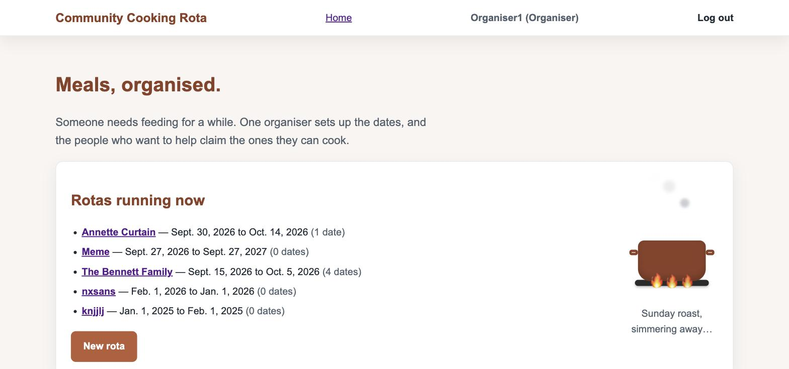
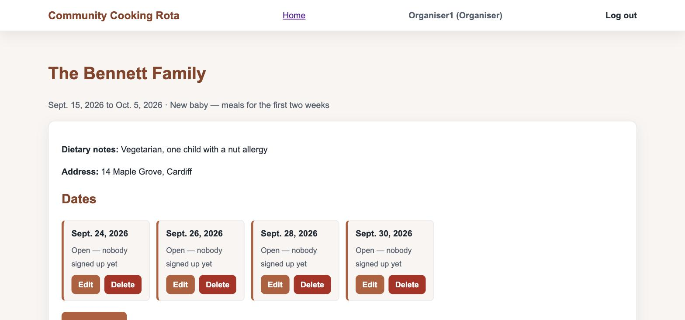
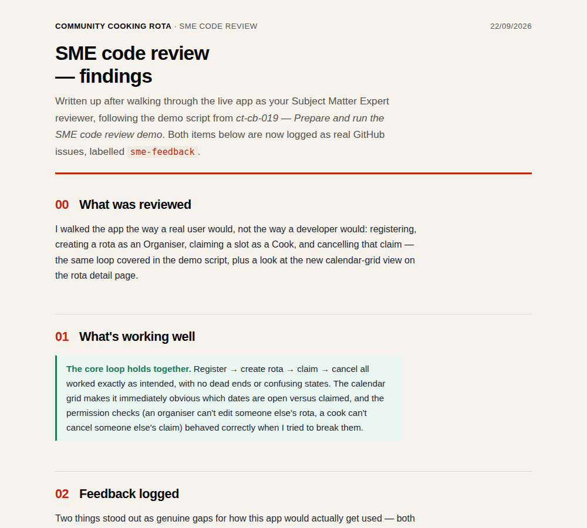

# Community Cooking Rota

**Live app:** https://community-cooking-rota-a0e405aa09f1.herokuapp.com/
**Repository:** https://github.com/sarahjhill/community-cooking-rota

## Introduction

Community Cooking Rota is a Django web app that helps a support network organise home-cooked meals for someone going through a hard patch — new parents, a household recovering from surgery or bereavement, or an elderly neighbour who could use the help. An organiser creates a rota for the recipient, sets the dates, and invites cooks; each cook registers, claims an open slot, and can see delivery and dietary details, cancelling if their plans change. It replaces the ad-hoc spreadsheet-and-WhatsApp approach with a simple, accountable, full CRUD web app built around one real, everyday problem.

This is a Full-Stack Individual Capstone Project for the Code Institute AI Augmented Full-Stack Bootcamp.

## The idea

A Django rebuild of the rota concept from the `cardiff-community-meals` project, reworked as a full account-based CRUD app (rather than a static link-and-access-code page) so it satisfies the auth, CRUD and testing requirements of this assessment.

- **Organiser** — creates a rota for a recipient, sets the date range, invites cooks, edits or deletes the rota and its slots.
- **Cook** — registers/logs in, browses open slots on rotas they've been invited to (or that are public), claims a slot, can cancel their own claim, sees dietary notes and delivery details.

## MVP scope

- User registration/login/logout with a role (Organiser or Cook) chosen at signup.
- Organiser: create, view, edit, delete a Rota (recipient, occasion, dietary notes, address, dates).
- Organiser: create, edit, delete Slots (cooking dates) within a Rota.
- Cook: view a Rota's open slots; claim a slot via a form (no admin panel); cancel their own claimed slot.
- Access control: only the organiser can edit/delete their own rota and its slots; only a slot's claimant (or the organiser) can un-claim it; anonymous users can't reach any of the above.
- On-page notifications (Django messages) for every create/update/delete/claim action.
- Responsive, accessible front end (Bootstrap 5 + custom CSS).
- Automated tests for models, views and permissions, plus a manual test log.
- Deployed to Heroku with `DEBUG=False` and secrets in environment variables.

**Deviation from the wireframes:** [`docs/wireframes.md`](docs/wireframes.md) sketched a desktop (≥768px) layout with the rota list and rota detail side-by-side in two columns. The build uses separate full-page views instead (list page → detail page) at every breakpoint. This was a deliberate call, not an oversight — a split view adds real complexity (keeping two panels in sync, extra routing/JS) for a capstone where the core assessed behaviour is the CRUD/permissions logic underneath, not the layout shape. Every other element of the wireframes (nav, cards, slot grid) is followed as sketched, and the layout is fully responsive at mobile/tablet/desktop.

## Data model (ERD)

`User 1—1 Profile` · `User 1—N Rota` (as organiser) · `Rota 1—N Slot` · `User 1—N Slot` (as cook, nullable until claimed)

See `docs/erd.md` for the full breakdown.

**Auto-generated architecture diagram:** [view on GitDiagram](https://gitdiagram.com/sarahjhill/community-cooking-rota) — an interactive map of how requests flow through the app (URLs → views → access control → models), generated straight from this repo's code.

## Screenshots

| Homepage | Rota detail (calendar view) |
|---|---|
|  |  |

**Responsive check:** tested across desktop, laptop, tablet and mobile breakpoints using [Am I Responsive?](https://fireship.dev/amiresponsive?url=https://community-cooking-rota-a0e405aa09f1.herokuapp.com/).


## Future features

- Recipe/dish attached to a slot, with its own CRUD (what's being cooked, allergens).
- Comment/update thread on a rota so cooks can leave notes for each other.
- Swap requests between cooks.
- Email reminders a day before a claimed slot.
- Public invite link + join code layered on top of accounts.
- iCal export / calendar view.
- Photo/confirmation upload when a meal is delivered.
- Search/filter rotas by dietary tag or date range.

## Tech stack

- Django 5 + Python 3
- SQLite locally, PostgreSQL in production
- Bootstrap 5 + custom CSS
- Django's built-in auth (`User` + a `Profile` model with a role field)
- Heroku for deployment

## Local setup

```bash
git clone https://github.com/sarahjhill/community-cooking-rota.git
cd community-cooking-rota
python3 -m venv .venv
source .venv/bin/activate   # Windows: .venv\Scripts\activate
pip install -r requirements.txt
python manage.py migrate
python manage.py runserver
```

## Testing

- **Automated tests:** 16 tests covering signup/login/logout, Rota CRUD, Slot CRUD, and ownership/permission checks on every mutating view (anonymous and wrong-user access correctly redirected or denied with a custom 403 page). Run them with:
  ```bash
  python manage.py test
  ```
- **Manual testing:** every user-facing flow (register as each role, create/edit/delete a rota, add/edit/delete a slot, claim, cancel) was walked through by hand on both desktop and mobile.
- **SME review:** a live walkthrough of the app with a Subject Matter Expert, run against the [SME code review demo guide](docs/sme-code-review-demo.html). Feedback was logged as real GitHub issues (labelled [`sme-feedback`](https://github.com/sarahjhill/community-cooking-rota/issues?q=is%3Aissue+label%3Asme-feedback)) rather than just discussed and forgotten. Full write-up below — click the image to read the whole document:

  [](docs/sme-review-findings.html)

  - [Issue #11 — No way to contact the cook or organiser from a rota page](https://github.com/sarahjhill/community-cooking-rota/issues/11) (Medium)
  - [Issue #12 — Claimed slots show a date but no time](https://github.com/sarahjhill/community-cooking-rota/issues/12) (Low)
- **Validators:** HTML, CSS and Python (PEP8) validator results to be added here.

## Deployment

Deployed to Heroku from this repository's `main` branch.

1. Create the Heroku app and add a Postgres database (`heroku addons:create heroku-postgresql`, or via the Dashboard's Resources tab).
2. Set the required Config Vars in the Heroku Dashboard (Settings → Config Vars) or via CLI:
   - `SECRET_KEY` — a unique Django secret key (never the one used locally)
   - `DATABASE_URL` — set automatically when the Postgres add-on is provisioned
3. Push the code to Heroku:
   ```bash
   git push heroku main
   ```
   This triggers the build, runs `collectstatic` automatically, and (via this project's `Procfile`) runs migrations before starting the app:
   ```
   release: python manage.py migrate --noinput
   web: gunicorn config.wsgi
   ```
4. **Important:** pushing to GitHub (`git push`) does **not** deploy to Heroku — `git push heroku main` is a separate step and must be run every time this repo is updated and the live site needs to reflect it.
5. Static files (CSS/JS) are served in production by [WhiteNoise](https://whitenoise.readthedocs.io/), configured in `config/settings.py`.

## AI usage

AI (Claude, via Anthropic's Claude Code/Cowork) was used throughout this project as a planning, debugging and pair-programming aid, working from my own project brief and the Code Institute assessment guide:

- **Planning:** drafting the initial MVP scope, data model and this README's structure from my brief.
- **Debugging:** diagnosing and fixing issues during development, including Python indentation errors and a live 500 error on deployment (root-caused to a stale Heroku deploy, not the code itself).
- **Feature build:** implementing the calendar-style date grid view on the rota page (template and CSS), and an ownership/permission-check audit across every CRUD view, with tests to match.
- **Process:** helping prepare and run a live SME code-review session, with feedback captured as GitHub issues.

All code was reviewed, tested and understood before being committed — AI assistance sped up implementation and caught issues, but the app's design decisions and final code are mine.

## Credits

Planning document and this MVP scope were developed with Claude (Anthropic) as a planning aid, working from the Code Institute assessment guide and Sarah Hill's own project brief.
